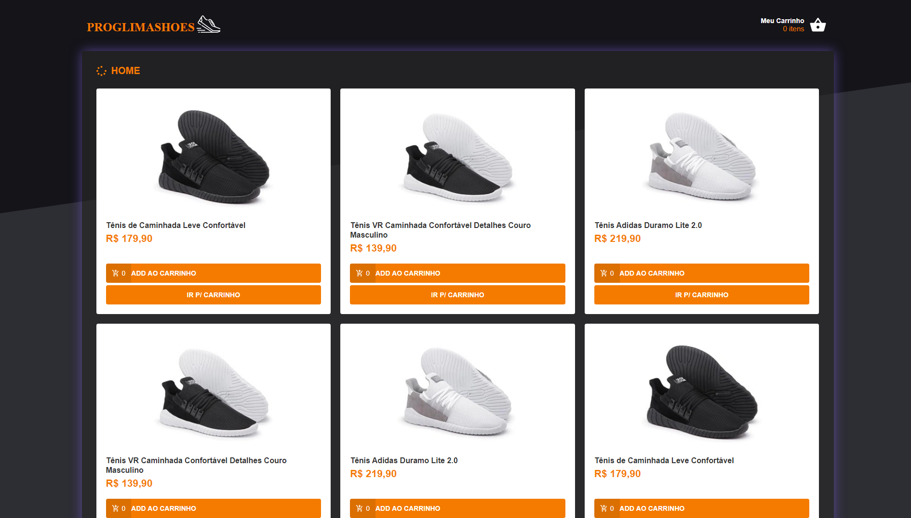
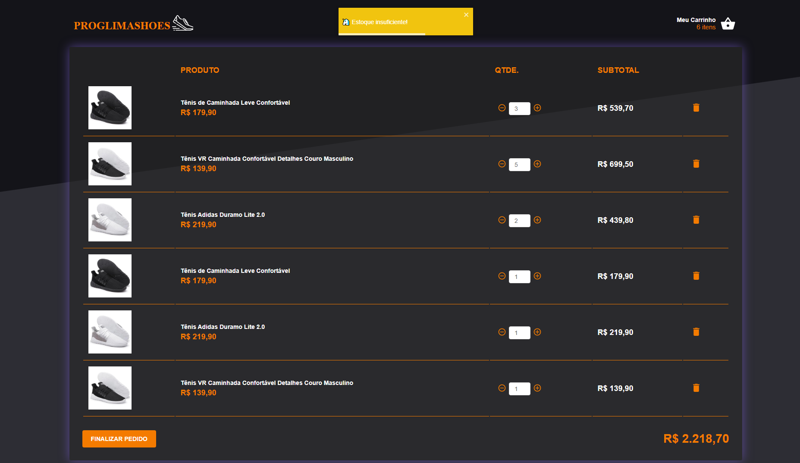

  
  
  

# PROGLIMA SHOES
<h4 align="center">
	🚧  React Select 🚀 Finalizado  🚧
</h4>

Projeto tem o objetivo analisar o comportamento do React, Hooks, Redux e Redux Saga.

  <kbd>
    
  </kbd>
  &nbsp;&nbsp;&nbsp;&nbsp;
  <kbd>
    
  </kbd>

## Tecnologias Utilizadas :books:
___
 * [ReactJS](https://reactjs.org/)
    * [React Hooks](https://reactjs.org/docs/hooks-intro.html)
     * [React History](https://www.npmjs.com/package/react-history)
     * [React Toastify](https://www.npmjs.com/package/react-history)
     * [Reactotron React](https://github.com/infinitered/reactotron)
 * [Redux](https://redux.js.org/)
 * [Redux Saga](https://redux-saga.js.org/)
 * [Axios](https://github.com/axios/axios)
 * [styled-components](https://styled-components.com/)
 * [date-fns](https://date-fns.org/)
 * [polished](https://polished.js.org/)
 * [immer](https://github.com/immerjs/immer)
 * [Yup](https://www.npmjs.com/package/yup)

## Como Usar:
___

#### 1) Clone & Install Dependencies

- 1.1) `git clone https://github.com/douglasproglima/proglima-shoes`
- 1.2) `cd proglima-shoes` - Entre no novo diretório criado.
- 1.3) Instale os pacotes com o Yarn `yarn install`

#### 2) Rodar o Projeto

- 2.1) **[Server]** Foi usado o pacote json-server para gerar dados fakes, para rodar o servidor que irá simular uma API: `json-server server.json -p 3333 -w`.

- 2.2) **[React]** Para rodar o frontend do React basta rodar: `yarn start`.

### Participante(s):
|Nome|E-mail|Certificado|Curso|
| -------- | -------- | -------- |-------- | -------- |
|Douglas Lima|douglasproglima@gmail.com|Sim|Bootcamp GoStack 9.0 - Rocketseat|
